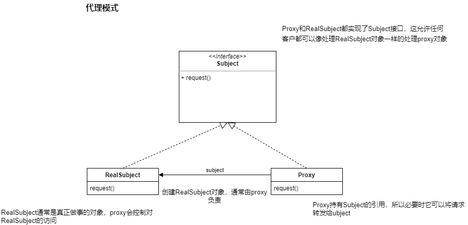

# 1.代理模式


## 1.定义

**代理模式**为另一个对象提供一个替身活占位符以控制这个对象的访问。


使用代理模式创建代表(representative)对象，让代表对象控制某对象的访问，被代理的对象可以是远程的对象，创建开销大的对象或需要安全控制的对象。

代理需要做的就是控制和管理访问。

代理的方式有许多种，代理以通过Internet为它们的代理对象搬运的整个方法调用而出名，它也可以代替某些懒惰的对象做一些事情。


## 2.案例


在状态模式，存在一个糖果机的案例。现在有一个需求，需要一个远程的监视器来监控糖果机的运行状态。并且这个监控器和糖果机运行在不同jvm上。


### 1.糖果机


```java
package com.lz.proxy;

import com.lz.state.*;

import java.rmi.RemoteException;
import java.rmi.server.UnicastRemoteObject;

/**
 * @author lz
 * @Package com.lz.state
 * @Description:
 * @date 2022/4/10 14:49
 */
public class GumballMachine extends UnicastRemoteObject implements GumballMachineRemote {

    State soldOutState;
    State noQuarterState;
    State hasQuarterState;
    State soldState;
    State winnerState;

    State state = soldOutState;

    String location;

    int count = 0;

    public GumballMachine(String location,int numberGumballs) throws RemoteException {
        soldOutState = new SoldOutState(this);
        noQuarterState = new NoQuarterState(this);
        hasQuarterState = new HasQuarterState(this);
        soldState = new SoldState(this);
        winnerState = new WinnerState(this);
        this.count = numberGumballs;
        this.location = location;
        if (numberGumballs > 0) {
            state = noQuarterState;
        }
    }

    public void insertQuarter() {
        state.insertQuarter();
    }


    public void ejectQuarter() {
        state.ejectQuarter();
    }


    public void turnCrank() {
        state.turnCrank();
        state.dispense();
    }

    public void setState(State state) {
        this.state = state;
    }

    public State getSoldState() {
        return soldState;
    }


    public State getWinnerState() {
        return winnerState;
    }

    public int getCount() {
        return count;
    }

    public State getNoQuarterState() {
        return noQuarterState;
    }

    public State getSoldOutState() {
        return soldOutState;
    }

    public State getHasQuarterState() {
        return hasQuarterState;
    }

    public String getLocation() {
        return location;
    }

    public State getState() {
        return state;
    }

    void releaseBall() {
        System.out.println("A gumball comes rolling out the slot.......");
        if (count != 0) {
            count = count - 1;
        }
    }


    @Override
    public String toString() {
        return "GumballMachineV2{" +
                "soldOutState=" + soldOutState +
                ", noQuarterState=" + noQuarterState +
                ", hasQuarterState=" + hasQuarterState +
                ", soldState=" + soldState +
                ", winnerState=" + winnerState +
                ", state=" + state +
                ", count=" + count +
                '}';
    }
}
```


### 2.远程接口


```java
public interface GumballMachineRemote extends Remote {

    public int getCount() throws RemoteException;

    public String getLocation() throws RemoteException;

    public State getState() throws RemoteException;
}
```


### 3.监控类


```java
public class GumballMonitor {

    GumballMachineRemote gumballMachine;

    public GumballMonitor(GumballMachineRemote gumballMachine) {
        this.gumballMachine = gumballMachine;
    }

    public void report() {
        try {
            System.out.println("Gumball Machine : " + gumballMachine.getLocation());
            System.out.println("Current inventory: " + gumballMachine.getCount());
            System.out.println("Current state : " + gumballMachine.getState());
        } catch (Exception e) {
            e.printStackTrace();
        }
    }
}
```


### 4.服务端测试程序


```java
public class GumballMachineTestDrive {

    public static void main(String[] args) {

        GumballMachineRemote gumballMachineRemote = null;

        try {

            int count = 100;
            gumballMachineRemote = new GumballMachine("m1.com", count);
            LocateRegistry.createRegistry(1099);
            Registry registry = LocateRegistry.getRegistry();
            registry.bind("gumballMachine", gumballMachineRemote);
            System.out.println("ok");
        } catch (Exception e) {
            e.printStackTrace();
        }

    }
}
```


### 5.客户端测试程序


```java
public class GumballMonitorTestDrive {

    public static void main(String[] args) {


        try {

            Registry registry = LocateRegistry.getRegistry("localhost");
            // 从Registry中检索远程对象的存根/代理
            GumballMachineRemote remoteMath = (GumballMachineRemote) registry.lookup("gumballMachine");

            GumballMonitor gumballMonitor = new GumballMonitor(remoteMath);
            gumballMonitor.report();
        } catch (Exception e) {
            e.printStackTrace();
        }


    }
}
```


## 3.类图





## 4.其他的代理


上面的案例中展示的是远程代理。

**远程代理：**

远程代理可以作为另一个JVM上对象的本地代表。调用代理的方法，会被代理利用网络转发到远程执行，并且结果会通过网络返回给代理，再由代理将结果转给客户。


**虚拟代理：**

虚拟代理作为创建开销大的对象的代表。虚拟代理经常直到我们真正需要一个对象的时候才创建它、当对象在创建前和创建中时，由虚拟代理来扮演对象的替身。对象创建后，代理就会将请求直接委托给对象。

这种方式就类似于当某个对象的创建需要一定时间时，先通过代理对象进行一定的处理，当真正的对象创建好后，通过线程或者其他的方式通知给代理对象，让真正的对象再去进行处理。


**java动态代理**