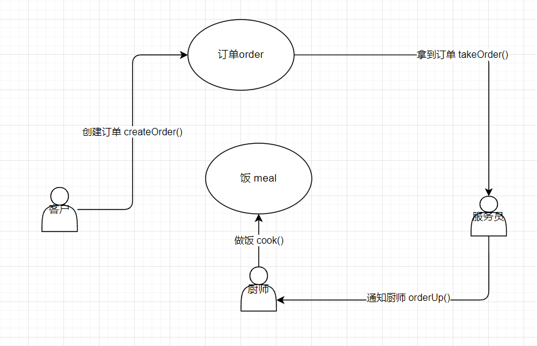
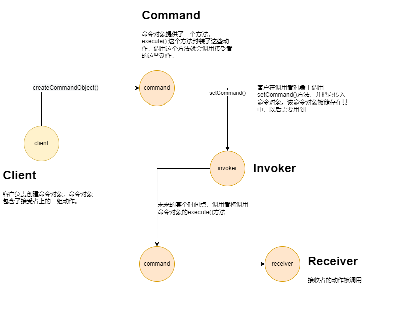
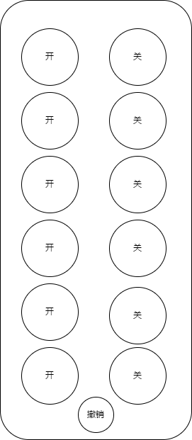
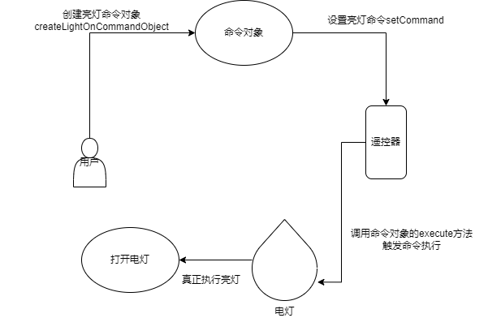
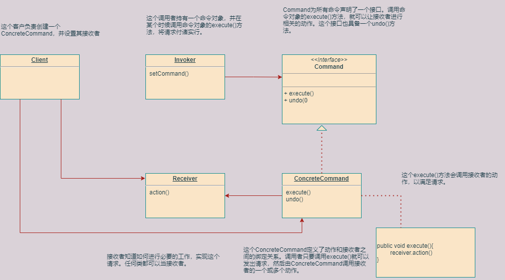

## 1.命令模式

设计模式主要分为三种类型，创建型模式、结构型模式以及行为型模式，命令模式属于其中的行为型。


### 2.案例一点餐

#### **需求：**

客户点餐、餐厅服务员拿到订单，将订单放到订单柜台，并通知厨师开始准备餐点、厨师开始准备餐点、最后做出订单上的餐点。

#### **需求分析：**

从面向对象角度，这个需求过程中存在的实体，客户、服务员、订单、厨师。

整个流程基本就是订单在各个体之间流转，然后通过订单上的信息，从而进行一系列的操作。




- 一张订单封装了所有准备餐点的请求。把订单想象成一个用来请求准备餐点的对象，和一般对象一样，订单对象可以被传递。订单的接口包含一个方法，就是orderUp()。


- 服务员的工作是接受订单，然后调用订单的orderUp()方法。在整个过程中，服务员是不关心订单上的具体信息的(忽略实际生活中的情形)，并且所有的订单都支持orderUp()方法，所以当需要下单的时候，调用orderUp()方法就可以了。


- 厨师才具有真正做饭的能力。只要orderUp()方法被调用了，厨师就知道需要做饭了。并且通过订单就知道需要做什么。


- 服务员和厨师之间是彻底解耦的。


通过上面的流程，我们其实就可以把顾客、服务员和厨师之间的行为，简单理解为 “发出请求的对象” 和“接受与执行这些请求的对象” 之间的行为。而在这之间进行传递的订单的就是请求或者是命令。

从命令模式的角度，流程图就可以理解为下面这个：





每个角色的对应关系：

服务员   =============  invoker

厨师   =============== receiver

orderUp ============  execute

订单  =============== command

顾客 ===============  client

takeOrder ========== setCommand


### 3.案列二遥控器



#### **需求：**

1）遥控器有几组开关按钮，还有一个撤销按钮。

2）这些开关按钮用来控制家电开关，如电灯、风扇、热水器、音响设备等。

3）我们希望能够创建一组遥控器的API，让每个开关按钮能够控制一个电器。

4）注意：要求提供扩展，能够方便未来添加新的电器控制开关。


#### **需求分析：**

从对象角度，这个需求过程中存在的实体：用户、遥控器、电灯、命令。

从命令模式的角度流程图如下：





采用命令模式实现：

1）命令模式可将“动作的请求者”从“动作的执行者”对象中解耦。请求者是用户、请求是按下的遥控器开关按钮的请求、执行者是具体的电器、遥控器是调用者。

2）客户发起开或关的请求，遥控器接收请求并调用相应的电器，电器进行相关的开或关操作。

3）把具体电器的开或关请求封装成请求对象，如打开电灯请求、关闭电灯请求等。每一个按扭就对应一个请求对象，按下按扭即调用请求的执行方法。

4）撤销按钮对应一个撤销请求，按下撤销按钮要调用对应请求的撤销方法。

当按下按钮的时候，就可以请命令对象做相关的工作。遥控器并不需要知道工作内容是什么，只要有个命令对象能和正确的对象沟通，把事情做好就可以了。所以，遥控器和电灯对象解耦了。

使用这个模式，我们能够创建一个API，将这些命令对象加载到对应的按钮开关，让遥控器的代码尽量保持简单。而把家电的工作和进行该工作的对象一起封装在命令对象中。


#### **首先是命令接口：**


```java
public interface Command{
    public void execute();
}
```

命令接口只需要一个方法execute()


#### **实现一个打开点灯的命令：**

电灯对象:

```java
public class Light {
    /***
     * 灯的打开
     */
    public void on(){
        System.out.println("开灯-----------------");
    }

    public void off() {
        System.out.println("关灯-----------------");
    }
}
```

打开电灯命令：

```java
public class LightOnCommand implements Command{
	Light light;
    public LightCommand(Light light){
        this.light = light;
    }
    
    public void execute(){
        light.on();
    }
}
```

这是一个命令，所以需要实现Command接口。

在构造方法中被传入了电灯对象，方面让命令进行控制。然后记录在实例变量中，一旦调用execute()就由这个电灯对象成为接收者，负责接受请求。从而调用电灯对象的对应方法。


#### **使用命令对象:**


```java
public class SimpleRemoteControl {

    /***
     * slot代表每次按按钮所要执行的命令
     */
    Command slot;

    public SimpleRemoteControl() {
    }

    public void setCommand(Command command) {
        this.slot = command;
    }

    /***
     * 具体的行为 按钮按下  命令执行
     */
    public void buttonWasPressed(){
        slot.exexute();
    }
}
```

SimpleRemoteControl代表着一个遥控器对象。每一个命令代表着遥控器上的一个按钮。

setCommand方法用来设置每一个按钮所控制的命令。如果说想要改变某个按钮的行为，就可以调用这个方法。

当按下按钮的时候，buttonWasPressed方法就会被触发，并且调用对应命令的execute()方法。


**整体的测试：**

```java
// 命令模式的客户 RemoteContrlTest
public class RemoteContrlTest {

    public static void main(String[] args) {
        // 遥控器  就是调用者，会传入一个命令对象，用来发出请求。
        SimpleRemoteControl simpleRemoteControl = new SimpleRemoteControl();
        // 灯 就是请求的接收者
        Light light = new Light();
        // 亮灯的命令 命令对象，绑定了一个接收者Light。
        LightOnCommand lightOnCommand = new LightOnCommand(light);

        // 将命令绑作为遥控器的一个槽绑定  就是命令传给调用者
        simpleRemoteControl.setCommand(lightOnCommand);
        // 遥控器按下
        simpleRemoteControl.buttonWasPressed();
    }
}
```


**执行结果;**

```
开灯-----------------
```


#### **根据需求完善代码：**

遥控器有很多槽，对应着多个命令。


```java
public class RemotrContrl {

    Command[] onCommands;
    Command[] offCommands;

    /***
     * 遥控器初始化
     */
    public RemotrContrl() {

        onCommands = new Command[7];
        offCommands = new Command[7];
        // 默认绑定一个空命令
        NoCommand noCommand = new NoCommand();
        for (int i = 0; i < 7; i++) {
            onCommands[i] = noCommand;
            offCommands[i] = noCommand;
        }
    }

    /***
     * 将具体的命令绑定到对应的遥控器的槽上
     * @param slot
     * @param onCommand
     * @param offCommand
     */
    public void setCommand(int slot, Command onCommand, Command offCommand) {
        onCommands[slot] = onCommand;
        offCommands[slot] = offCommand;
    }

    /***
     * 遥控器具体的行为 -- 第slot个按钮被按下 开
     * @param slot
     */
    public void onButtonWasPushed(int slot) {
        onCommands[slot].exexute();
    }

    /***
     * 遥控器具体的行为 -- 第slot个按钮被按下 关
     * @param slot
     */
    public void offButtonWasPushed(int slot) {
        offCommands[slot].exexute();
    }


    @Override
    public String toString() {

        StringBuffer stringBuffer = new StringBuffer();
        stringBuffer.append("\n-----------------Remote Contrl---------------------\n");
        for (int i = 0; i < onCommands.length; i++) {
            stringBuffer.append("[slot " + i + " " + onCommands[i].getClass().getName() + "      " + offCommands[i].getClass().getName() + "\n");
        }
        return stringBuffer.toString();
    }
}

```

初始化的时候默认绑定空命令：

```java
public class NoCommand implements Command {

    @Override
    public void exexute() {
        System.out.println("没有绑定命令，啥也不干");
    }
}

```


音箱打开命令：

```java
public class StereoOnCommand implements Command {

    Stereo stereo;

    public StereoOnCommand(Stereo stereo){
        this.stereo = stereo;
    }

    @Override
    public void exexute() {
        stereo.on();
        stereo.setCD();
        stereo.setVolume();
    }
}
```

音箱关闭命令：

```java
public class StereoOffCommand implements Command {

    Stereo stereo;

    public StereoOffCommand(Stereo stereo) {
        this.stereo = stereo;
    }


    @Override
    public void exexute() {
        stereo.off();
    }
}

```

音箱对象：

```java
public class Stereo {

    public void on() {
        System.out.println("音箱打开");
    }

    public void off() {
        System.out.println("音箱关闭");
    }

    public void setCD() {
        System.out.println("音箱setCD");
    }

    public void setVolume() {
        System.out.println("音箱setVolume");
    }
}

```

测试类：

```java
public class RemoteLoader {

    public static void main(String[] args) {

        RemotrContrl remotrContrl = new RemotrContrl();


        Light light = new Light();
        Stereo stereo = new Stereo();


        LightOnCommand lightOnCommand = new LightOnCommand(light);
        LightOffCommand lightOffCommand = new LightOffCommand(light);
        StereoOnCommand stereoOnCommand = new StereoOnCommand(stereo);
        StereoOffCommand stereoOffCommand = new StereoOffCommand(stereo);

        remotrContrl.setCommand(0,lightOnCommand,lightOffCommand);
        remotrContrl.setCommand(1,stereoOnCommand,stereoOffCommand);

        System.out.println(remotrContrl.toString());

        remotrContrl.onButtonWasPushed(0);
        remotrContrl.offButtonWasPushed(0);

        remotrContrl.onButtonWasPushed(1);
        remotrContrl.offButtonWasPushed(1);
    }
}

```

执行结果：

```
开灯-----------------
关灯-----------------
音箱打开
音箱setCD
音箱setVolume
音箱关闭
```


#### 增加撤销功能：

```java
public interface Command {

     void exexute();

     void undo();
}

```


```java
public class LightOnCommand implements Command {

    Light light;

    public LightOnCommand(Light light) {
        this.light = light;
    }

    @Override
    public void exexute() {
        light.on();
    }

    @Override
    public void undo() {
        light.off();
    }
}

```

**测试类：**

```java
public class RemoteLoader {

    public static void main(String[] args) {

        RemotrContrl remotrContrl = new RemotrContrl();


        Light light = new Light();
        Stereo stereo = new Stereo();


        LightOnCommand lightOnCommand = new LightOnCommand(light);
        LightOffCommand lightOffCommand = new LightOffCommand(light);
        StereoOnCommand stereoOnCommand = new StereoOnCommand(stereo);
        StereoOffCommand stereoOffCommand = new StereoOffCommand(stereo);

        remotrContrl.setCommand(0,lightOnCommand,lightOffCommand);
        remotrContrl.setCommand(1,stereoOnCommand,stereoOffCommand);

        System.out.println(remotrContrl.toString());

        remotrContrl.onButtonWasPushed(0);
        remotrContrl.offButtonWasPushed(0);、
        // 撤销
        remotrContrl.undoButtonWasPushed(0);

        remotrContrl.onButtonWasPushed(1);
        remotrContrl.offButtonWasPushed(1);
    }
}

```


执行结果：


```
开灯-----------------
关灯----------------
开灯啦-----------------


音箱打开
音箱setCD
音箱setVolume
音箱关闭
```


### 4.定义:

命令模式：将“请求”封装成对象，以便使用不同的请求、队列或者日志来参数化其他对象。命令模式也支持可撤销的操作。


### 5.类图：




### 6.应用场景


#### 队列请求：

一个工作队列，在某一端添加命令，然后另一端则是线程。线程进行下面的动作：从队列中取出一个命令，调用它的execute()方法，等待这个调用完成，然后将此命令对象丢弃，再取出下一个精灵.....


**参考：**

[命令队列]: https://www.cnblogs.com/JsonShare/p/7206607.html
[命令模式的用途：具体的例子多线程队列请求]: https://blog.csdn.net/dengjili/article/details/79546480


#### **日志请求：**

**概念**：将所有的动作都记录在日志中，并能在系统死机后，重新调用这些动作恢复到之前的状态。当我们执行命令的时候，将历时记录存储在磁盘中。一旦系统死机，我们就可以将命令对象重新加载，并依次调用这些对象的execute()方法。

**实现方法**：利用对象的序列化把对象保存起来（记录日志），在需要的时候反序列化（恢复事务）。

**请求日志文件可以实现很多功能，常用功能如下**：

　　1、什么事情都存在意外，如一旦系统发生故障，日志文件可以为系统提供一种恢复机制，在请求日志文件中可以记录用户对系统的每一步操作，从而让系统能够顺利恢复到某一个特定的状态；

　　2 、请求日志也可以用于实现批处理，在一个请求日志文件中可以存储一系列命令对象，例如一个命令队列；

　　3、可以将命令队列中的所有命令对象都存储在一个日志文件中，每执行一个命令则从日志文件中删除一个对应的命令对象，防止因为断电或者系统重启等原因造成请求丢失，而且可以避免重新发送全部请求时造成某些命令的重复执行，只需读取请求日志文件，再继续执行文件中剩余的命令即可。


**参考：**

[命令模式（4）——命令模式扩展之日志请求]: https://www.cnblogs.com/wutianqi/p/10338511.html
[设计模式解密（11）- 命令模式 - 扩展篇（请求日志）]: https://www.cnblogs.com/JsonShare/p/7206665.html


### 7.优点

- 更松散的耦合，将发起命令的客户端与具体处理命令的接收者完全解耦，客户端完全不知道接收者是什么样子。


- 更动态的控制，把请求封装起来，可以动态的对请求进行参数化、队列化和日志化等，使系统更灵活。


- 复合命令，很容易的组合命令，即宏命令，使系统功能更强大。


- 更好的扩展，很容易添加新的命令
  

### 8.劣势

- 类数量随命令数量增长而增长。可能造成类数量过多。


