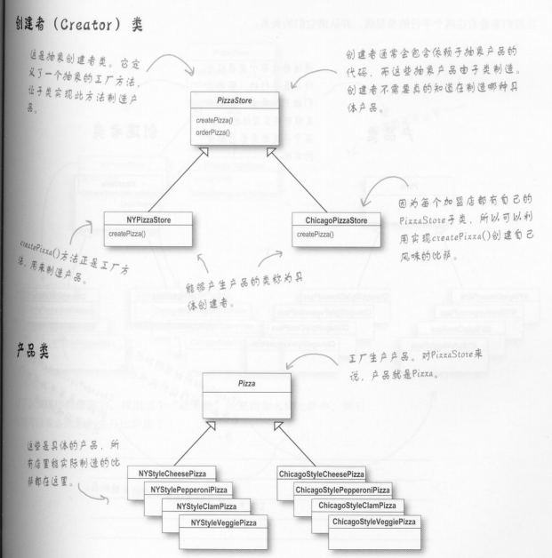
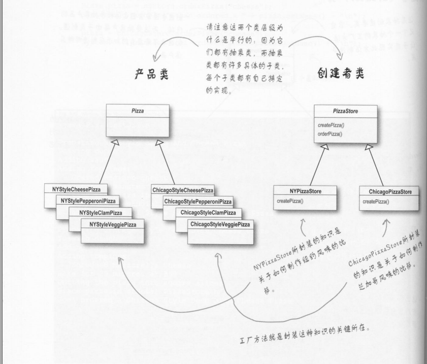

#### 1.工厂方法模式

工厂方法模式：定义了一个创建对象的接口，但由于子类决定要实例化的类是哪一个。工厂方法让类把实例化推迟到子类。

看过了上面的简单工厂，解决了根据不同类型创建不同披萨的问题。但是创建披萨的过程被工厂类限制住了，不能在创建披萨的过程中为不同种类的披萨添加一些灵活的逻辑。



```java
/**
 * @author lz
 * @Package com.lz.factory.absFactory
 * @Description: 抽象的披萨商店  抽象工厂 定义了产品制造的流程，但是却不限制具体的制造方法
 * @date 2021/9/11 17:21
 */
public  abstract  class PizzaStore {

    public Pizza orderPizza(String type){

        Pizza pizza;

        pizza = createPizza(type);

        pizza.prepare();

        pizza.bake();

        pizza.cut();

        pizza.box();

        return pizza;
    }

    /***
     * 由子类去决定如果做披萨
     * @param type
     * @return
     */
    abstract Pizza createPizza(String type);
}

```

将简单工厂模式的orderPizza方法拉回来，同时将PizzaStore改变为抽象类。

PizzaStore就只定义了预定披萨的流程作为规范，但由于Pizza对象是抽象的，OrderPizza并不知道哪些实际的具体类参与进来，这就是解耦。

并且具体的创建披萨createPizza的方法定义为抽象方法，由不同的子类去实现。

```java
package com.lz.factory.absFactory;

/**
 * @author lz
 * @Package com.lz.factory.absFactory
 * @Description: 具体的披萨店  
 * @date 2021/9/11 17:28
 */
public class NYPizzaStore extends PizzaStore {

    @Override
    Pizza createPizza(String type) {
        if ("NYStyleCheese".equals(type)) {
            return new NYStyleCheesePizza();
        } else if ("NYStyleVeggie".equals(type)) {
            return new NYStyleVeggiePizza();
        }

        return null;
    }
}

```




