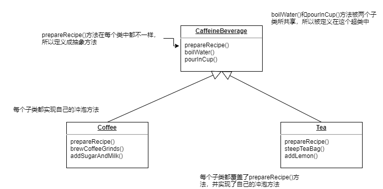
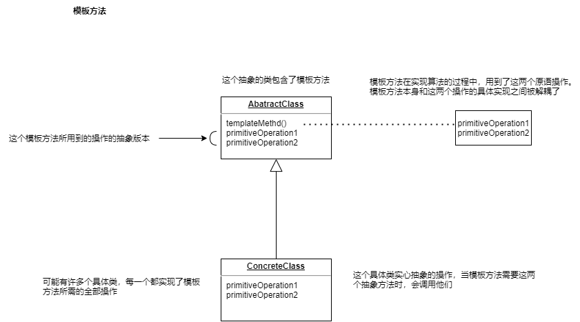

# 1.模板方法


## 1. 案列一


现在需要冲泡咖啡和茶叶两种饮品，步骤如下：

| 咖啡冲泡方法   | 茶叶冲泡方法   |      |
| -------------- | -------------- | ---- |
| 把水煮沸       | 把水煮沸       |      |
| 用沸水冲泡咖啡 | 用沸水冲泡茶叶 |      |
| 把咖啡倒进杯子 | 把茶倒进杯子   |      |
| 加糖和牛奶     | 加糖和牛奶     |      |


如果不考虑设计方面，只是用对象的方式去实现，那么步骤应该如下：

**咖啡：**

```java
public Class Coffee {
    
    void prepareRecipe(){
        boilWater();
        brewCoffeeGrinds();
        pourInCup();
        addSugarAndMilk();
    }
    
    public void boilWater(){
        System.out.println("Boiling Water");
    }
    
    public void brewCoffeeGrinds(){
        System.out.println("Dripping Coffee through filter");
    }
    public void pourInCup(){
        System.out.println("Poring into cup");
    }
    public void addSugarAndMilk(){
        System.out.println("Adding Sugar and milk");
    }
}
```

**茶：**

```java
public Class Tea {
    
    void prepareRecipe(){
        boilWater();
        brewTeaBag();
        pourInCup();
        addLemon();
    }
    
    public void boilWater(){
        System.out.println("Boiling Water");
    }
    
    public void brewTeaBag(){
        System.out.println("Steeping the tea");
    }
    public void pourInCup(){
        System.out.println("Poring into cup");
    }
    public void addLemon(){
        System.out.println("Adding Lemon");
    }
}
```


现在来看上面的两个类，明显存在可重用的方法 ： prepareRecipe()   boilWater()  pourInCup()

所以需要设计一下，设计的类图可能如下：





看起来很完善了，但是我们要进一步完善设计：

实际上，无论是冲泡咖啡还是茶，整个流程基本都是一致的:

- 把水煮沸
- 用热水泡咖啡或者茶
- 把饮料倒进杯子
- 在饮料内加入适当的调料


所以要将prepareRecipe()方法更加的抽象化，

将不可变的部分，也就是整个步骤让其不可改变。

做法不同的内容，让子类去实现

做法相同的内容，让父类定义好

```java
// 咖啡因饮料是一个抽象类
public abstract class CaffeineBeverage {

    /***
     * 现在用一个prepareRecipe方法来处理茶和咖啡、prepareRecipe被生命为final。因为我们不希望子类覆盖这个方法。
     * 将步骤2和步骤4泛华成为brew()和addCondiments()
     */
    final void prepareRecipe() {
        boilWater();
        brew();
        pourInCup();
        addCondiments();
    }

    /***
     *  因为咖啡和茶处理这些方法的做法不同，所以和两个方法必须被声明为抽象，剩余的东西留给子类去关心
     */
    abstract void addCondiments();

    abstract void brew();

    /***
     *  固定的内容 则有父类定义好
     */
    void boilWater() {
        System.out.println("Boiling water");
    }

    void pourInCup() {
        System.out.println("Pouring into cup");
    }
}

```

**此时的咖啡：**

```java
public class Coffee extends CaffeineBeverage {


    @Override
    void addCondiments() {
        System.out.println("Adding Sugar and milk");
    }

    @Override
    void brew() {
        System.out.println("Boiling Water");
    }


}

```

**此时的茶：**

```java
public class Tea extends CaffeineBeverage {

    @Override
    void addCondiments() {
        System.out.println("Adding Lemon");
    }

    @Override
    void brew() {
        System.out.println("Steeping the tea");
    }
    
}
```


## 2.定义：


**模板方法模式：**

在一个方法中定义一个算法的骨架，而将一些步骤延迟都子类红、模板方法使得子类可以在不改变算法结构的情况下，重新定义算法中的某些步骤。


这个模式是用来创建一个算法的模板，模板就是一个方法、更具体的说，这个方法将算法定义成一组步骤，其中的任何步骤都可以是抽象的，由子类负责实现、这可以确保算法的结构保持不变，同时子类提供部分实现。


## 3.类图:





## 4.钩子


```java
// 抽象类。它被声明为抽象，用来作为基类，其子类必须实现其操作
public abstract  class AbatractClass {
    
    // 模板方法 被声明为final，已免子类改变这个算法的顺序
    // 模板方法定义了一连串的步骤，每个步骤由一个方法代表
    final void templateMethod(){
        primitiveOperation1();
        primitiveOperation2();
        concreteOperation();
    }
    // 两个原语操作，具体子类必须实现他们
     abstract void primitiveOperation2();

     abstract void primitiveOperation1();
    
    // 这个抽象类有一个具体的操作
     void concreteOperation(){
         // 这里是实现
     }

}

```


那么，在模板方法中可以存在哪些类型的方法：

```java
public abstract  class AbatractClass {


    final void templateMethod(){
        primitiveOperation1();
        primitiveOperation2();
        concreteOperation();
        hook();  // 增加了一个钩子方法
    }

     abstract void primitiveOperation2();

     abstract void primitiveOperation1();

    /***
     * 这个具体的方法被定义在抽象类中，将它声明为final，这样一来子类就无法覆盖它。它可以被模板方法直接使用，或者被子类使用
     */
     final void concreteOperation(){
         // 这里是实现
     }

    /***
     * 这个一个具体的方法，但它什么事情都不做
     *
     * 这种默认不做事的方法，称之为 钩子方法。 子类可以视情况决定要不要覆盖他们
     */
    void hook(){}

}

```


钩子是一种被声明在抽象类中的方法，但是只有空或者默认的实现。钩子的存在，让子类有能力对算法的不同点进行挂钩。要不要挂钩，由子类决定。


**带钩子方法的模板方法：**


```java
public abstract class CaffeineBeverageWithHook {

    
    final void prepareRecipe() {
        boilWater();
        brew();
        pourInCup();
        if (customerWantsCondiments()) {
            addCondiments();
        }
    }
    
    abstract void addCondiments();

    abstract void brew();
    
    void boilWater() {
        System.out.println("Boiling water");
    }

    void pourInCup() {
        System.out.println("Pouring into cup");
    }

    /***
     *   这里定义了一个方法，(通常)是空的缺省实现。这个方法只会返回true，不做别的事情
     *   
     *   这就是一个钩子，子类可以覆盖这个方法，但不见得一定要这么做
     * 
     */
    boolean customerWantsCondiments() {
        return true;
    }


}
```


**使用钩子**

为了使用钩子，我们需要在子类中覆盖它。


```java
public class CoffeeWithHook extends CaffeineBeverageWithHook {


    @Override
    void addCondiments() {
        System.out.println("Adding Sugar and milk");
    }

    @Override
    void brew() {
        System.out.println("Boiling Water");
    }

    /***
     *  覆盖了钩子方法，并提供了自己的功能
     * @return
     */
    @Override
    boolean customerWantsCondiments() {
        String answer = getUserInput();

        if (answer.toLowerCase().startsWith("y")) {
            return true;
        }
        return false;
    }

    private String getUserInput() {

        String answer = null;

        System.out.println("Would you like milk and sugar with your coffee (y/n) ?");

        BufferedReader bufferedReader = new BufferedReader(new InputStreamReader(System.in));
        try {
            answer = bufferedReader.readLine();
        } catch (IOException ioe) {
            System.out.println("IO error trying to read your answer");
        }

        if (answer == null) {
            return "no";
        }

        return answer;
    }
}

```


**测试：**

```java
  public static void main(String[] args) {

        CaffeineBeverageWithHook coffeeWithHook = new CoffeeWithHook();

        coffeeWithHook.prepareRecipe();
    }
```


**执行结果：**

```
Boiling water
Boiling Water
Pouring into cup
Would you like milk and sugar with your coffee (y/n) ?
y
Adding Sugar and milk
```


## 5.java中的应用


模板方法有很多实现，看起来可能和上面所说的不是那么一致。


Java数组类Arrays提供了一个方便的模板方法用来排序。

```java
  public static void sort(Object[] a) {
        if (LegacyMergeSort.userRequested)
            legacyMergeSort(a);
        else
            ComparableTimSort.sort(a, 0, a.length, null, 0, 0);
    }
   

private static void legacyMergeSort(Object[] a) {
        Object[] aux = a.clone();
        mergeSort(aux, a, 0, a.length, 0);
    }
```


mergeSort()方法包含排序算法，此算法依赖于compareTo()方法的实现来完成算法

```java
private static void mergeSort(Object[] src,
                              Object[] dest,
                              int low,
                              int high,
                              int off) {
    int length = high - low;

    // Insertion sort on smallest arrays
    if (length < INSERTIONSORT_THRESHOLD) {
        for (int i=low; i<high; i++)
            for (int j=i; j>low &&
                     ((Comparable) dest[j-1]).compareTo(dest[j])>0; j--)
                // 我们需要实现compareTo()方法，“填补”模板方法的缺憾
                swap(dest, j, j-1);
        return;
    }

 ......
}
```


上面可以看到，具体的compareTo()需要存放在数组中的对象自己去实现， 也就是去实现Comparable接口，实现compareTo()方法。

Arrays.sort()

可以看到sort()方法控制算法，没有类可以改变这一点。sort()依赖一个Comparable类提供compareTo()的实现。
