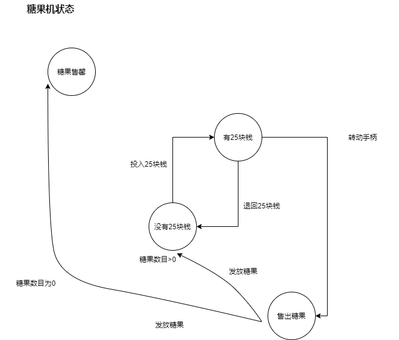
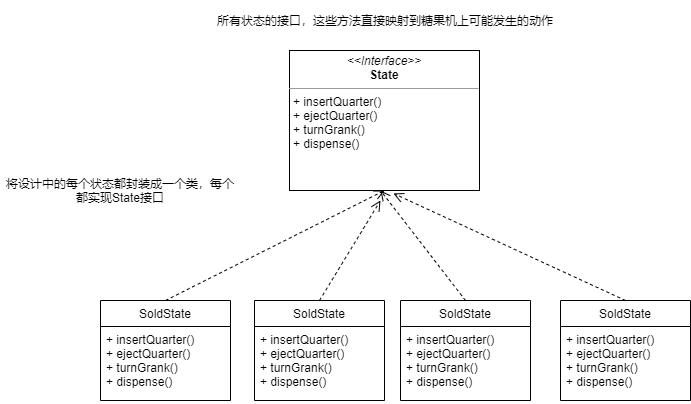

# 1.状态模式


## 1.事物的状态

策略模式是围绕可以互换的算法来创建成功业务的。

状态模式通过改变对象内部的状态来帮助对象控制自己的行为。


## 2.案列

### 1.糖果机

现在厂家需要一个控制糖果机的程序，糖果机的状态变化如下：




看到这个图，应该能够很快意识到，这个糖果机存在四种状态，这四种状态是控制糖果机能够正常流转的关键。

一般我们遇到这种状态变化的业务场景，一般会这么做。

为每一个动作创建一个方法，在方法中进行状态的判断用以处理所对应的状况。

```java

public class GumballMachine {

    /***
     *  售罄
     */
    final static int SOLD_OUT = 0;
    /***
     * 未投入钱
     */
    final static int NO_QUARTER = 1;
    /***
     * 投入了钱
     */
    final static int HAS_QUARTER = 2;
    /***
     * 卖出糖果
     */
    final static int SOLD = 3;

    int state = SOLD_OUT;
    int count = 0;

    /***
     * 初始化 设置糖果数量 如果数量大于0  设置糖果机状态为 未投入钱
     * @param count
     */
    public GumballMachine(int count) {
        this.count = count;
        if (count > 0) {
            state = NO_QUARTER;
        }
    }

    /***
     *  动作 投入钱
     */
    public void insertQuarter() {
        if (state == HAS_QUARTER) {
            System.out.println("You can't insert another quarter!");
        } else if (state == NO_QUARTER) {
            state = HAS_QUARTER;
            System.out.println("You inserted a quarter");
        } else if (state == SOLD_OUT) {
            System.out.println("You can't insert a quarter; the machine is sold out");
        } else if (state == SOLD) {
            state = HAS_QUARTER;
            System.out.println("please wait , we're already giving you a gumball");
        }
    }

    /***
     *  动作 退回钱
     */
    public void ejectQuarter() {
        if (state == HAS_QUARTER) {
            System.out.println("Quarter returned");
            state = NO_QUARTER;
        } else if (state == NO_QUARTER) {
            System.out.println("You inserted a quarter");
        } else if (state == SOLD_OUT) {
            System.out.println("You can't eject,you haven't inserted a quarter yet");
        } else if (state == SOLD) {
            System.out.println("Sorry , you already turned the crank");
        }
    }


    /***
     *  动作 转动手柄
     */
    public void turnCrank() {
        if (state == SOLD) {
            System.out.println("Turning twice doesn't get you another gumball");
        } else if (state == NO_QUARTER) {
            System.out.println("You turned but there's no quarter");
        } else if (state == SOLD_OUT) {
            System.out.println("You turned ,but there are no gumballs");
        } else if (state == HAS_QUARTER) {
            System.out.println("You turned...");
            state = SOLD;
            dispense();
        }
    }


    /***
     *  动作 发放糖果
     */
    public void dispense() {
        if (state == SOLD) {
            System.out.println("A gumball comes rolling out the slot");
            count = count - 1;
            if (count == 0) {
                System.out.println("Oops,out of gumballs");
                state = SOLD_OUT;
            } else {
                state = NO_QUARTER;
            }
        } else if (state == NO_QUARTER) {
            System.out.println("You need to pay first ");
        } else if (state == SOLD_OUT) {
            System.out.println("No gumball dispensed");
        } else if (state == HAS_QUARTER) {
            System.out.println("No gumball dispensed");
        }
    }
}

```


### **2.测试：**

```java
public class GumballMachineTestDrive {

    public static void main(String[] args) {

        GumballMachine gumballMachine = new GumballMachine(5);

        System.out.println(gumballMachine);

        gumballMachine.insertQuarter();

        gumballMachine.turnCrank();

        System.out.println(gumballMachine);

        gumballMachine.insertQuarter();
        gumballMachine.ejectQuarter();
        gumballMachine.turnCrank();

        System.out.println(gumballMachine);

    }

}
```


**结果：**

```
GumballMachine{state=1, count=5}
You inserted a quarter
You turned...
A gumball comes rolling out the slot
GumballMachine{state=1, count=4}
You inserted a quarter
Quarter returned
You turned but there's no quarter
GumballMachine{state=1, count=4}

Process finished with exit code 0

```


### 3.需求变更

当手柄被转动的时候，有10%的记录掉下来两个糖果。


如果继续使用上面的代码设计，我们就需要再增加一种赢家的状态，并且在各个方法中增加更多的判断逻辑。

如果对于原代码进行过多的变更，说明我们之前的设计是不完善的，需要新的设计。


### 4.新的设计


重写现有代码以便于将状态对象封装在各自的类中，然后再动作发生时委托给当前状态。

- 首先，定义一个State接口。在这个接口内，糖果机的每个动作都有一个对应的方法。

- 然后为机器中的每个状态实现状态类、这些类将负责在对应的状态下进行机器的行为。

- 最后，将动作委托到状态类。





### 5.实现状态类


#### 1.state接口

```java
public interface State {

    void insertQuarter();

    void ejectQuarter();

    void turnCrank();

    void dispense();
}
```

#### 2.没有投入钱的状态类


```java
public class NoQuarterState implements State{

    GumballMachineV2 gumballMachine;

    public NoQuarterState(GumballMachineV2 gumballMachine) {
        this.gumballMachine = gumballMachine;
    }

    @Override
    public void insertQuarter() {
        System.out.println("You inserted a quarter");
    }

    @Override
    public void ejectQuarter() {
        System.out.println("You haven't inserted a quarter");
    }

    @Override
    public void turnCrank() {
        System.out.println("You turned but there's no quarter");
    }

    @Override
    public void dispense() {
        System.out.println("You need to pay first ");
    }
}
```


#### 3.投入钱的状态类

```java
public class HasQuarterState implements State{

    Random random = new Random(System.currentTimeMillis());

    GumballMachineV2 gumballMachine;

    public HasQuarterState(GumballMachineV2 gumballMachine) {
        this.gumballMachine = gumballMachine;
    }

    @Override
    public void insertQuarter() {
        System.out.println("You can't insert another quarter!");
    }

    @Override
    public void ejectQuarter() {
        System.out.println("Quarter returned");
    }

    @Override
    public void turnCrank() {
        System.out.println("You turned...");
        int winner = random.nextInt(10);
        if((winner == 0) && (gumballMachine.getCount() > 1)){
            gumballMachine.setState(gumballMachine.getWinnerState());
        }else{
            gumballMachine.setState(gumballMachine.getSoldState());
        }

    }

    @Override
    public void dispense() {
        System.out.println("No gumball dispensed");
    }
}
```


#### 4.卖出的状态类

```java
public class SoldState implements State {


    GumballMachineV2 gumballMachine;

    public SoldState(GumballMachineV2 gumballMachine) {
        this.gumballMachine = gumballMachine;
    }

    @Override
    public void insertQuarter() {
        System.out.println("please wait , we're already giving you a gumball");
    }

    @Override
    public void ejectQuarter() {
        System.out.println("Sorry , you already turned the crank");
    }

    @Override
    public void turnCrank() {
        System.out.println("Turning twice doesn't get you another gumball");
    }

    @Override
    public void dispense() {
        gumballMachine.releaseBall();
        if (gumballMachine.getCount() > 0) {
            gumballMachine.setState(gumballMachine.getNoQuarterState());
        } else {
            System.out.println("Oops , out of gumballs");
            gumballMachine.setState(gumballMachine.getSoldOutState());
        }
    }
}
```

#### 5.卖光的状态类


```java
public class SoldOutState implements State{

    GumballMachineV2 gumballMachine;

    public SoldOutState(GumballMachineV2 gumballMachine) {
        this.gumballMachine = gumballMachine;
    }

    @Override
    public void insertQuarter() {
        System.out.println("You can't insert a quarter; the machine is sold out");
    }

    @Override
    public void ejectQuarter() {
        System.out.println("You can't eject,you haven't inserted a quarter yet");
    }

    @Override
    public void turnCrank() {
        System.out.println("You turned ,but there are no gumballs");
    }

    @Override
    public void dispense() {
        System.out.println("No gumball dispensed");
    }
}
```


#### 6.赢家状态

```java
public class WinnerState implements State {


    GumballMachineV2 gumballMachine;

    public WinnerState(GumballMachineV2 gumballMachine) {
        this.gumballMachine = gumballMachine;
    }

    @Override
    public void insertQuarter() {
        System.out.println("please wait , we're already giving you a gumball");
    }

    @Override
    public void ejectQuarter() {
        System.out.println("Sorry , you already turned the crank");
    }

    @Override
    public void turnCrank() {
        System.out.println("Turning twice doesn't get you another gumball");
    }

    @Override
    public void dispense() {
        System.out.println("You're a winner , you get two gumballs for your quarter");
        gumballMachine.releaseBall();
        if (gumballMachine.getCount() == 0) {
            gumballMachine.setState(gumballMachine.getSoldOutState());
        } else {
            gumballMachine.releaseBall();
            if(gumballMachine.getCount() > 0){
                gumballMachine.setState(gumballMachine.getNoQuarterState());
            }
            System.out.println("Oops , out of gumballs");
            gumballMachine.setState(gumballMachine.getSoldOutState());
        }
    }
}
```


#### 7.糖果机


```java
public class GumballMachineV2 {

    State soldOutState;
    State noQuarterState;
    State hasQuarterState;
    State soldState;
    State winnerState;

    State state = soldOutState;

    int count = 0;

    public GumballMachineV2(int numberGumballs) {
        soldOutState = new SoldOutState(this);
        noQuarterState = new NoQuarterState(this);
        hasQuarterState = new HasQuarterState(this);
        soldState = new SoldState(this);
        winnerState = new WinnerState(this);
        this.count = numberGumballs;
        if (numberGumballs > 0) {
            state = noQuarterState;
        }
    }

    public void insertQuarter() {
        state.insertQuarter();
    }


    public void ejectQuarter() {
        state.ejectQuarter();
    }


    public void turnCrank() {
        state.turnCrank();
        state.dispense();
    }

    public void setState(State state) {
        this.state = state;
    }

    public State getSoldState() {
        return soldState;
    }


    public State getWinnerState() {
        return winnerState;
    }

    public int getCount() {
        return count;
    }

    public State getNoQuarterState() {
        return noQuarterState;
    }

    public State getSoldOutState() {
        return soldOutState;
    }

    public State getHasQuarterState() {
        return hasQuarterState;
    }

    void releaseBall() {
        System.out.println("A gumball comes rolling out the slot.......");
        if (count != 0) {
            count = count - 1;
        }
    }


    @Override
    public String toString() {
        return "GumballMachineV2{" +
                "soldOutState=" + soldOutState +
                ", noQuarterState=" + noQuarterState +
                ", hasQuarterState=" + hasQuarterState +
                ", soldState=" + soldState +
                ", winnerState=" + winnerState +
                ", state=" + state +
                ", count=" + count +
                '}';
    }
}
```


由GumballMachineV2类中的一个属性state记录当前糖果机的状态，当触发不同的动作的时候，进而触发对应状态下的行为。

类相对第一种设计衍生出来了很多，但是逻辑上看起来更加清晰了。


### 6.已经做的


将每个状态的行为局部化到它自己的类中

将容易产生问题的**if**语句删除，已方便日后的维护

让每一个状态“对修改关闭”，让糖果机“对扩展开放”，因为可以加入新的状态类

创建一个新的代码基和类结构，这更能映射万能糖果公司的图，而且更容易阅读和理解。


## 3.定义


状态模式允许对象在内部状态改变时改变它的行为，对象看起来好像修改了它的类。


状态模式将状态封装成独立的类，并将动作委托到代表当前状态的对象，我们知道行为会随着内部状态而改变。


## 4.类图


## 5.策略模式和状态模式


策略模式和状态模式的类图是一模一样的。

对于状态模式而言，我们将一群行为封装在状态对象中，context的行为随时可委托到哪些状态对象中的一个。随着时间流逝，当前状态在状态对象集合中游走改变，以反映出context内部的状态，因此，context的行为也会跟着改变。但是context的客户对于状态对象了解不多，甚至根本是浑然不觉。

而对于策略模式而言，客户通常主动指定context所需要组合的策略对象是哪一个。现在，固然策略模式让我们具有弹性，能够在运行时改变策略，但对于某个context来说，通常都只有一个最适当的策略对象。

一般来说，我们把策略模式想成是除了继承之外的一种弹性替代防范，如果你使用继承定义了一个类的行为，你将被这个行为困住，甚至要修改它都能难。有了策略模式，你可以通过组合不同的对象来改变行为。

我们把状态模式想成是不用在context中放置许多条件判断的替代方案。通过将行为包装进状态对象中，你可以通过在context内简单地改变状态对象来改变context的行为。


