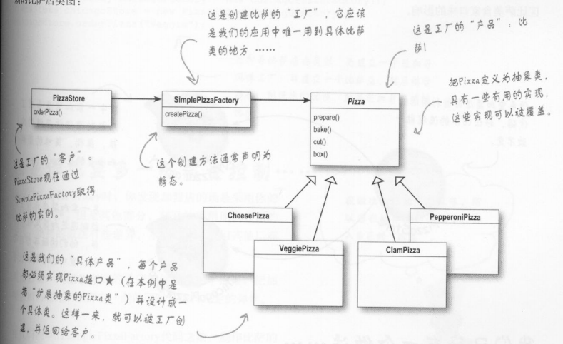

#### 1.简单工厂模式



工厂的客户，披萨商品：

```java
package com.lz.factory.SimpleFactory;


public class PizzaStore {

    SimplePizzaFactory factory;

    public PizzaStore(SimplePizzaFactory factory) {
        this.factory = factory;
    }


    public Pizza orderPizza(String type) {

        Pizza pizza;

        pizza = factory.createPizza(type);

        pizza.prepare();

        pizza.bake();

        pizza.cut();

        pizza.box();

        return pizza;
    }
}

```

披萨商品提供了预定披萨和创建披萨的方法，但是创建披萨这一步骤可能因为披萨种类不同，实现会有所不同。

将变化的部分抽出去，也就是将创建披萨的部分放到工厂中。

```java
package com.lz.factory.SimpleFactory;


public class SimplePizzaFactory {

	// 根据传入的类型不同 创建不同的披萨
    public Pizza createPizza(String type) {

        Pizza pizza = null;

        if (type.equals("cheese")) {
            pizza = new CheesePizze();
        } else if (type.equals("cheese")) {
            pizza = new PepperoniPizza();
        }

        return pizza;
    }
}

```

有了工厂和客户，好需要产出的产品，这里就是披萨。这里将披萨作为一个抽象类，让子类去自己实现不同披萨的不同行为。

```java
package com.lz.factory.SimpleFactory;

public abstract class Pizza {


    abstract void prepare();

    abstract void bake();

    abstract void cut();

    abstract void box();

}

```

```java
package com.lz.factory.SimpleFactory;

public class CheesePizze extends Pizza {

    @Override
    void prepare() {
        System.out.println("CheesePizze prepare......");
    }

    @Override
    void bake() {

    }

    @Override
    void cut() {

    }

    @Override
    void box() {

    }
}

```

```java
package com.lz.factory.SimpleFactory;

/**
 * @author lz
 * @Package com.lz.factory.SimpleFactory
 * @Description:
 * @date 2021/9/11 16:56
 */
public class PepperoniPizza extends Pizza{

    @Override
    void prepare() {
        System.out.println("PepperoniPizza prepare......");
    }

    @Override
    void bake() {

    }

    @Override
    void cut() {

    }

    @Override
    void box() {

    }
}

```

测试一下：

```java
package com.lz.factory.SimpleFactory;

/**
 * @author lz
 * @Package com.lz.factory.SimpleFactory
 * @Description: 简单工厂模式测试
 * @date 2021/9/11 16:59
 */
public class FactoryTest {


    public static void main(String[] args) {

        SimplePizzaFactory factory = new SimplePizzaFactory();

        PizzaStore pizzaStore = new PizzaStore(factory);

        Pizza pizza = pizzaStore.orderPizza("cheese");

    }
}

```

、