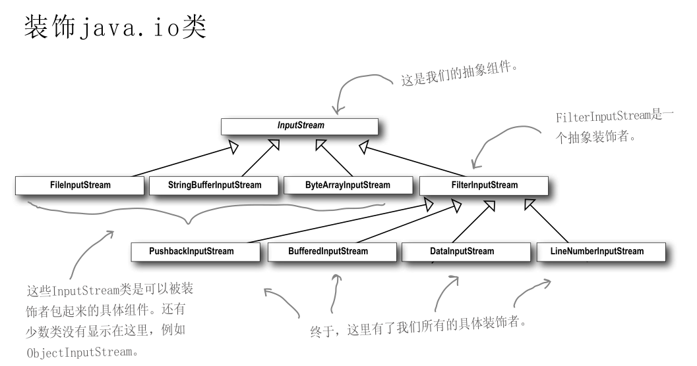

### 1.装饰者模式

装饰者模式：动态地将责任附加到对象上，若要扩展功能，装饰者提供了比继承更有弹性的替代方案

我的理解就是如果想要构建一个对象，但是这个对象需要进行层层包装，为其添加不同的行为，并且这些行为是否添加是不确定的，就可以使用装饰者。

并且允许类进行扩展，在不修改现有代码的情况下，就可搭配新的行为。


**角色**
Component（抽象构件）：它是具体构件和抽象装饰类的共同父类，声明了在具体构件中实现的业务方法，它的引入可以使客户端以一致的方式处理未被装饰的对象以及装饰之后的对象，实现客户端的透明操作。

ConcreteComponent（具体构件）：它是抽象构件类的子类，用于定义具体的构件对象，实现了在抽象构件中声明的方法，装饰器可以给它增加额外的职责（方法）。

Decorator（抽象装饰类）：它也是抽象构件类的子类，用于给具体构件增加职责，但是具体职责在其子类中实现。它维护一个指向抽象构件对象的引用，通过该引用可以调用装饰之前构件对象的方法，并通过其子类扩展该方法，以达到装饰的目的。

ConcreteDecorator（具体装饰类）：它是抽象装饰类的子类，负责向构件添加新的职责。每一个具体装饰类都定义了一些新的行为，它可以调用在抽象装饰类中定义的方法，并可以增加新的方法用以扩充对象的行为。

由于具体构件类和装饰类都实现了相同的抽象构件接口，因此装饰模式以对客户透明的方式动态地给一个对象附加上更多的责任，换言之，客户端并不会觉得对象在装饰前和装饰后有什么不同。装饰模式可以在不需要创造更多子类的情况下，将对象的功能加以扩展。

装饰模式的核心在于抽象装饰类的设计。


**代码中的装饰者模式**


**JAVA中IO类中的装饰者模式**




测试类入口：

```
com.lz.decorator.TestDecorator
```


利用装饰者模式，常常造成设计中有大量的小类，数量实在太多，可能会造成使用此API的程序员的困扰。

