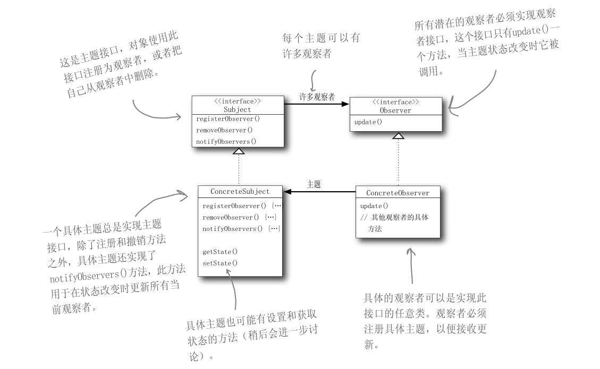

### 1.观察者模式

观察者模式：在对象之间定义一个一对多的依赖，这样一来，当一个对象改变状态，依赖它的对象都会收到通知，并自动更新。

我的理解就是有一个被观察的对象，并且还存在一些观察者。当这个被观察的对象某些状态发生变化的时候，需要通知到观察者。同时，观察者还可以随时决定(包括运行时)是否继续观察，如果选择不观察，可以移除。


**代码中的观察者模式设计图：**




自己实现观察者模式测试类入口:

```java
com.lz.Observer.WeatherStation
```

使用java.util.Observable实现观察者模式：

```
com.lz.UtilObserver.TestUtilObserver
```

java.util.Observable的观察者模式更加的完善，考虑到了空指针、并发等情况，使用这个比较方便。

但是要注意一点，java.util.Observable是一个类，所以被观察者只能选择继承的方式，还想继承另一个类，那就不能选择java.util.Observable了。

**应用场景：**

比如微信公众号的发布


