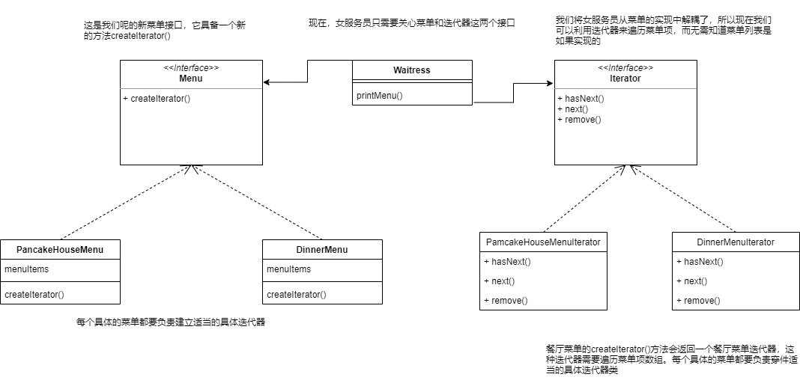
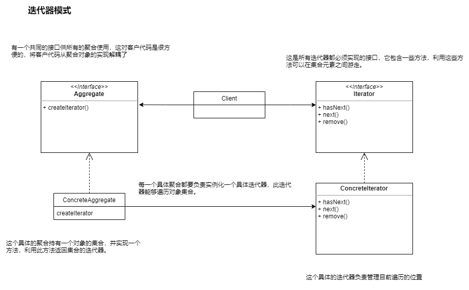
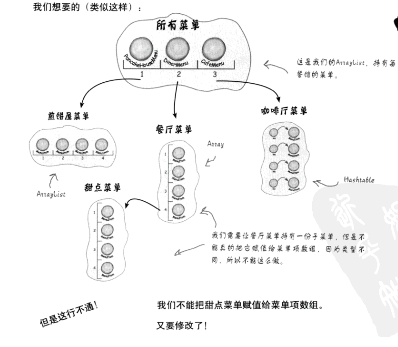

# 1.迭代器模式


## 1.案例

现在有两个餐厅，煎饼屋以及一个A餐厅。这两个餐馆准备合并。这两个餐馆都有自己的菜单，合并之后我们当然需要一个整合后的菜单，将两者提供的餐食都提供。


### **菜单项目的基础实现：**

```java
package com.test.iterator;


public class MenuItem {

    /**
     * 菜品名称
     */
    String name;
    /***
     * 描述
     */
    String description;
    /***
     * 素食
     */
    boolean vegetarian;
    /***
     * 价格
     */
    double price;

    public MenuItem(String name, String description, boolean vegetarian, double price) {
        this.name = name;
        this.description = description;
        this.vegetarian = vegetarian;
        this.price = price;
    }

    public String getName() {
        return name;
    }

    public void setName(String name) {
        this.name = name;
    }

    public String getDescription() {
        return description;
    }

    public void setDescription(String description) {
        this.description = description;
    }

    public boolean isVegetarian() {
        return vegetarian;
    }

    public void setVegetarian(boolean vegetarian) {
        this.vegetarian = vegetarian;
    }

    public double getPrice() {
        return price;
    }

    public void setPrice(double price) {
        this.price = price;
    }
}

```

菜单的实现可以看到包含了菜单应该包含的一些基本属性，如菜品名称、价格等，并且提供了对挺的getter方法让你可以获取对应的属性。

煎饼屋和A餐厅在菜单的基础结构上都保持了一致。

但是存储菜单项的数据结构上，煎饼屋和A餐厅产生了分歧：


### **煎饼屋的菜单实现：**

```java
package com.test.iterator;

import java.util.ArrayList;

/***
 * @author :
 * @version : v1.0
 * @package : com.test.iterator
 * @className : PancakeHouseMenu
 * @description : 煎饼屋菜单
 * @createDate : 2022/3/9
 */
public class PancakeHouseMenu {

    ArrayList menuItems;

    public PancakeHouseMenu(ArrayList menuItems) {
        this.menuItems = new ArrayList();

        addItem("K&B Pancake Breakfast", "Pancakes with scrambled eggs, and toast", true, 2.99);
        addItem("Regular Pancake Breakfast", "Pancakes with fried eggs, and toast", false, 2.99);
    }

    public void addItem(String name, String description, boolean vegetarian, double price) {
        MenuItem menuItem = new MenuItem(name, description, vegetarian, price);
        menuItems.add(menuItem);

    }

    public ArrayList getMenuItems() {
        return menuItems;
    }
    // .......
}

```

可以看到煎饼屋的菜单存储 是通过ArrayList这个数据结构实现的。


### **A餐厅的菜单实现：**

```java
public class DinnerMenu {

    static final int MAX_ITEMS = 6;

    int numberOfItems = 0;

    MenuItem[] menuItems;

    public DinnerMenu() {
        menuItems = new MenuItem[MAX_ITEMS];

        addItem("Vegetraian BLT", "(Fakin') Bacon with lettuce & tomato on whole wheat", true, 2.99);

        addItem("BLT", "Bacon with lettuce & tomato on whole wheat", false, 2.99);

    }


    public void addItem(String name, String description, boolean vegetarian, double price) {
        MenuItem menuItem = new MenuItem(name, description, vegetarian, price);
        if (numberOfItems >= MAX_ITEMS) {
            System.out.println("Sorry,menu is full! Can't add item to menu");
        } else {
            menuItems[numberOfItems] = menuItem;
        }
        numberOfItems++;
    }


    public MenuItem[] getMenuItems() {
        return menuItems;
    }
}

```

A餐厅的菜单项目存储是通过数组去实现的。


现在存在了两种不同的菜单表现方式，会有什么问题呢？

现在有一个女服务员的对象，所拥有的方法大概是这样：

```java
public class Waitress {
    
    // 输出菜单的每一项
    printMenu();
    // 输出早餐 
    printBreakfaseMenu();
    // 输出午餐
    printLunchMenu();
    // 输出素食
    printVegetarianMenu();
    // 是否为素食
    isItemVegetarian(name);
}

```

现在我们去实现 printMenu()方法：


```java
void printMenu() {

        PancakeHouseMenu pancakeHouseMenu = new PancakeHouseMenu();
        ArrayList menuItems = pancakeHouseMenu.getMenuItems();

        for (int i = 0; i < menuItems.size(); i++) {
            MenuItem menuItem = (MenuItem) menuItems.get(i);
            System.out.print(menuItem.getName() + " ");
            System.out.println(menuItem.getPrice() + " ");
            System.out.println(menuItem.getDescription());
        }

        DinnerMenu dinnerMenu = new DinnerMenu();
        MenuItem[] dinnerMenuItems = dinnerMenu.getMenuItems();
        for (int i = 0; i < dinnerMenuItems.length; i++) {
            System.out.print(dinnerMenuItems[i].getName() + " ");
            System.out.println(dinnerMenuItems[i].getPrice() + " ");
            System.out.println(dinnerMenuItems[i].getDescription());
        }


    }
```


如果要实现女服务员的其他方法，做法也是类似。

总是需要处理两个菜单，并且使用两个循环去遍历这些菜单项。

如果是三个餐厅合并，那么就会有三次循环。


我们当然不希望这样做，所以需要找到一个方法，让他们的菜单实现一个相同的接口。


###  **封装变化的部分** 

这里要注意一个重点： **封装变化的部分** ，这里变化的部分就是由于不同的集合类型所造成的遍历。

煎饼屋菜单项的遍历需要 ArrayList的size()和get()方法

```java
for (int i = 0; i < menuItems.size(); i++) {
            MenuItem menuItem = (MenuItem) menuItems.get(i);
}
```

A餐厅菜单项的遍历需要数组的length字段和中括号

```java
   for (int i = 0; i < dinnerMenuItems.length; i++) {
            System.out.print(dinnerMenuItems[i].getName() + " ");
   }
```


现在我们创建一个对选哪个，将它称为迭代器，利用它封装”**遍历结合内的每个对象的过程**“：

针对ArrayList：

```java
Iterator iterator = pancakeHouseMenu.createIterator();
while(iterator.hasNext()){
    MenuItem menuItem = (MenuItem)iterator.next();
}
```

针对数组：

```java
Iterator iterator = dinnerMenu.createIterator();
while(iterator.hasNext()){
    MenuItem menuItem = (MenuItem)iterator.next();
}
```


现在能够看到两者之前的变化都被封装起来了。


### **在餐厅菜单中加入一个迭代器：**

定义迭代器接口 ：

```java
public interface Iterator{
    boolean hasNext();

    Object next();
}
```

需要实现一个具体的迭代器，为餐厅菜单服务：

```java
public class DinnerMenuItearator implements Iterator {

    MenuItem[] items;
    int position = 0;

    public DinnerMenuItearator(MenuItem[] items) {
        this.items = items;
    }

    @Override
    public boolean hasNext() {
        if (position >= items.length || items[position] == null) {
            return false;
        }
        return true;
    }

    @Override
    public Object next() {
        MenuItem item = items[position];
        position++;
        return item;
    }
}
```


### 用迭代器改写餐厅菜单：

```java
public class DinnerMenu {

    static final int MAX_ITEMS = 6;

    int numberOfItems = 0;

    MenuItem[] menuItems;

    public DinnerMenu() {
        menuItems = new MenuItem[MAX_ITEMS];

        addItem("Vegetraian BLT", "(Fakin') Bacon with lettuce & tomato on whole wheat", true, 2.99);

        addItem("BLT", "Bacon with lettuce & tomato on whole wheat", false, 2.99);

    }


    public void addItem(String name, String description, boolean vegetarian, double price) {
        MenuItem menuItem = new MenuItem(name, description, vegetarian, price);
        if (numberOfItems >= MAX_ITEMS) {
            System.out.println("Sorry,menu is full! Can't add item to menu");
        } else {
            menuItems[numberOfItems] = menuItem;
        }
        numberOfItems++;
    }

	// 这个方法不再需要了
//    public MenuItem[] getMenuItems() {
//        return menuItems;
//    }

    public Iterator createIterator(){
        return  new DinnerMenuItearator(menuItems);
    }
}

```

### 修改女服务员的代码:

```java
public class Waitress {

    PancakeHouseMenu pancakeHouseMenu;
    DinnerMenu dinnerMenu;

    public Waitress(PancakeHouseMenu pancakeHouseMenu, DinnerMenu dinnerMenu) {
        this.pancakeHouseMenu = pancakeHouseMenu;
        this.dinnerMenu = dinnerMenu;
    }


    void printMenu1() {

        Iterator iterator = pancakeHouseMenu.createIterator();
        Iterator iterator1 = dinnerMenu.createIterator();
        System.out.println("Menu\n------------\nPancakeHouse");
        printMenu(iterator);
        System.out.println("Menu\n------------\nDinner");
        printMenu(iterator1);

    }

    private void printMenu(Iterator iterator) {
        while (iterator.hasNext()){
            MenuItem menuItem = (MenuItem) iterator.next();
            System.out.print(menuItem.getName() + " ");
            System.out.println(menuItem.getPrice() + " ");
            System.out.println(menuItem.getDescription());
        }

    }
```

为煎饼屋和A餐厅分辨创建迭代器，迭代器中根据ArrayList和数组不同的数据结构，进行合适的方法实现。

并且在煎饼屋和A餐厅的菜单项目中提供获取迭代器的方法，并且在这过程中，将菜单项注入进对应的迭代器。

女服务员的类中提供一个基于迭代器遍历的实现。并且只是一个循环。


测试方法：

```java
public class MenuTestDrive {


    public static void main(String[] args) {
        PancakeHouseMenu pancakeHouseMenu = new PancakeHouseMenu();
        DinnerMenu dinnerMenu = new DinnerMenu();

        Waitress waitress = new Waitress(pancakeHouseMenu,dinnerMenu);
        waitress.printMenu1();
    }
}
```


到此为止，我们已经实现了迭代器模式。但是代码还有优化的空间。 比如说女服务的初始化是依赖于PancakeHouseMenu和DinnerMenu的。针对这点，我们可以将菜单项抽象成接口，让女服务员的初始化不依赖于具体的实现。 

```java
public interface Menu {

    Iterator createIterator();
}

```

```
public class Waitress {

    Menu pancakeHouseMenu;
    Menu dinnerMenu;

    public Waitress(Menu pancakeHouseMenu, Menu dinnerMenu) {
        this.pancakeHouseMenu = pancakeHouseMenu;
        this.dinnerMenu = dinnerMenu;
    }

.......

    }
```


### 类图：




## 2.定义：

迭代器模式 

提供一种方法顺序访问一个聚合对象中的各个元素，而又不暴露其内部的表示。


迭代器模式让我们能游走于聚合内的每一个元素，而又不暴露其内部的表示。

把游走的任务放在迭代器上，而不是聚合上。这样简化了聚合的接口和实现，也让责任各得其所。


## 3.类图：




# 2.组合模式


## 1.案列

继续迭代器模式中的餐厅菜单案例，在迭代器中已经实现了菜单项包含在菜单中。通过迭代器模式能够让女服务员遍历出所有的菜单项。

现在有个需求，希望给一个菜单项增加一个甜品菜单的子菜单。



一般我们看到父子这种关系，都会想到树形结构。

而且还要支持女服务员顺利的遍历打印出所有的菜单项。

还需要能够灵活的遍历菜单项的功能，比如只遍历甜品菜单，或者遍历餐厅菜单。


## 2.组合模式定义

组合模式允许将对象组合成树形结构来表现"整体/部分"层次结构。组合能让客户以**一致**的方式处理个别对象以及对象组合。


组合模式让我们能用树形方式创建对象的结构，树里面包含了组合以及个别的对象。

使用组合结构，我们能把相同的操作应用在组合和个别对象上。换句话说，在大多数情况下，我们可以**忽略对象组合和个别对象之间的差别**。


## 3.利用组合设计菜单

需要创建一个组件接口来作为菜单和菜单项的共同接口，让我们能够用统一的做法来处理菜单和菜单项。


## 4.类图


## 5.实现菜单组件

菜单组件的角色是为叶节点和组合节点提供一个共同的接口。


因为有些方法只对菜单有意义，而有些则只对菜单项有意义，默认实现是抛出UnsupportedOperationException异常。这样，如果菜单项或菜单不支持某个操作，他们就不需要做任何事情，直接继承默认实现就可以了。

```java
public abstract class MenuComponent {

    public void add(MenuComponent menuComponent) {
        throw new UnsupportedOperationException();
    }

    public void remove(MenuComponent menuComponent) {
        throw new UnsupportedOperationException();
    }

    public MenuComponent getChild(int i) {
        throw new UnsupportedOperationException();
    }

    public String getName() {
        throw new UnsupportedOperationException();
    }

    public String getDescription() {
        throw new UnsupportedOperationException();
    }

    public double getPrice() {
        throw new UnsupportedOperationException();
    }

    public boolean isVegetarian() {
        throw new UnsupportedOperationException();
    }

    public void print() {
        throw new UnsupportedOperationException();
    }
}

```


## 6.实现菜单项


```java
// 扩展MenuComponent
public class MenuItem extends MenuComponent {

    /**
     * 菜品名称
     */
    String name;
    /***
     * 描述
     */
    String description;
    /***
     * 素食
     */
    boolean vegetarian;
    /***
     * 价格
     */
    double price;

    public MenuItem(String name, String description, boolean vegetarian, double price) {
        this.name = name;
        this.description = description;
        this.vegetarian = vegetarian;
        this.price = price;
    }

    @Override
    public String getName() {
        return name;
    }

    @Override
    public String getDescription() {
        return description;
    }

    @Override
    public boolean isVegetarian() {
        return vegetarian;
    }

    @Override
    public double getPrice() {
        return price;
    }
	 /***
     *  这和之前的实现不一样，在MenuComponent类里我们覆盖了print()方法。
     *  对菜单项来说，此方法会打印出完整的菜单项，包括 名字 描述 价格 是否为素食
     */
    public void print() {
        System.out.println("  " + getName());
        if (isVegetarian()) {
            System.out.println("(v)");
        }
        System.out.println(", " + getPrice());
        System.out.println("     -- " + getDescription());
    }

}
```


## 7.实现组合菜单

上面已经实现了组合类，我们还需要一个菜单，并且菜单可以持有菜单项或其他菜单。


```java
public class Menu extends  MenuComponent{
    // 用来存储子菜单或者菜单项
    ArrayList menuComponents = new ArrayList();
    String name;
    String description;

    public Menu(String name, String description) {
        this.name = name;
        this.description = description;
    }

    @Override
    public void add(MenuComponent menuComponent) {
        menuComponents.add(menuComponent);
    }

    @Override
    public void remove(MenuComponent menuComponent) {
        menuComponents.remove(menuComponent);
    }

    @Override
    public MenuComponent getChild(int i) {
        return  (MenuComponent)menuComponents.get(i);
    }

    @Override
    public String getName() {
        return  name;
    }

    @Override
    public String getDescription() {
        return  description;
    }
    
    @Override
    public void print() {
        System.out.println("\n" + getName());
        System.out.println(", " + getDescription());
        System.out.println("------------------------");
    }
}

```


## 8. 修改print方法


可以看到上面菜单的print只能打印出当前菜单的一些基本信息，但是我们期望的是 除了打印当前菜单的信息，还要打印它所包含的菜单或者菜单项的信息。


修改后的Menu累的print方法。

```java
   @Override
    public void print() {
        System.out.println("\n" + getName());
        System.out.println(", " + getDescription());
        System.out.println("------------------------");
        Iterator iterator = menuComponents.iterator();

        while (iterator.hasNext()) {
            MenuComponent menuComponent = (MenuComponent) iterator.next();
            menuComponent.print();
        }

    }
```


## 9.服务员类


```java
public class Waitress {
	// 直接使用最顶层的菜单组件
    MenuComponent allMenus;

    public Waitress(MenuComponent allMenus) {
        this.allMenus = allMenus;
    }


    public void printMenu() {
        allMenus.print();
    }

}
```


## 10.测试


```java
public class MenuTestDrive {

    public static void main(String[] args) {

        MenuComponent pancakeHouseMenu =  new Menu("PANCAKE HOUSE MENU","Breakfase");
        MenuComponent dinnerMenu =  new Menu("DINNER MENU","Lunch");
        MenuComponent cafeMenu =  new Menu("CAFE MENU","Dinner");
        MenuComponent dessertMenu =  new Menu("DESSERT MENU","Dessert of course");

        MenuComponent allMenus =  new Menu("ALL MENUS","All menus combined");

        allMenus.add(pancakeHouseMenu);
        allMenus.add(cafeMenu);
        allMenus.add(dinnerMenu);

        dinnerMenu.add(new MenuItem(
                "Pasta",
                "Spaghetti............",
                true,
                3.89
        ));

        dinnerMenu.add(dessertMenu);

        dessertMenu.add(new MenuItem(
                "Apple Pie",
                "Applie Pie..........",
                true,
                1.59
        ));

        Waitress waitress = new Waitress(allMenus);

        waitress.printMenu();
    }
}
```


## 11.单一？

我们现在看到 组合模式不但要管理层级结构，还要执行菜单的操作。明显违反了 单一责任的准则。


组合模式以单一责任设计原则换取透明性(transparency)。什么是透明性?通过让组件的接口同时包含一些管理子节点和叶结点的操作，客户就可以将组合和叶结点一视同仁。

也就是说，一个元素究竟是组合还是叶结点，对客户是透明的。

组合模式可以勘测合格是一个折中案列。


## 12. 组合迭代器


```java
public class Menu extends  MenuComponent{
    // ....
    @Override
    public Iterator createIterator() {
        return new CompositeIterator(menuComponents.iterator());
    }
}
```


CompositeIterator 迭代器，用来遍历组件内的菜单项，而且确保素哟偶的子菜单(或者更深层次的菜单)都被包括进来。

```java
public class CompositeIterator implements Iterator {

    Stack stack = new Stack();

    public CompositeIterator(Iterator iterator) {
        stack.push(iterator);
    }

    @Override
    public Object next() {
        if (hasNext()) {
            Iterator iterator = (Iterator) stack.pop();
            MenuComponent menuComponent = (MenuComponent) iterator.next();
            if (menuComponent instanceof Menu) {
                stack.push(menuComponent.createIterator());
            }
            return menuComponent;
        } else {
            return null;
        }
    }

    @Override
    public boolean hasNext() {
        if (stack.isEmpty()) {
            return false;
        } else {
            Iterator iterator = (Iterator) stack.peek();
            if (!iterator.hasNext()) {
                stack.pop();
                return hasNext();
            } else {
                return true;
            }
        }
    }

    @Override
    public void remove() {
        throw new UnsupportedOperationException();
    }
}
```