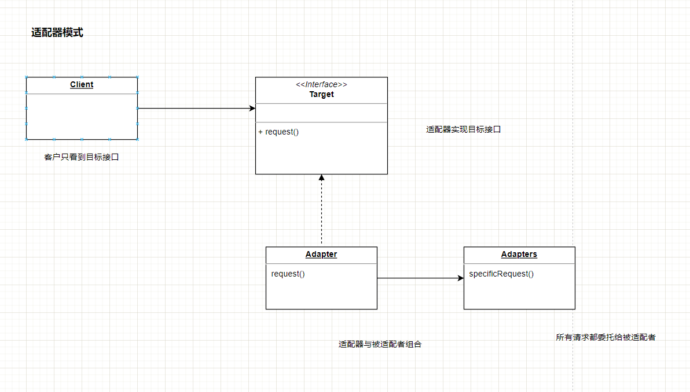
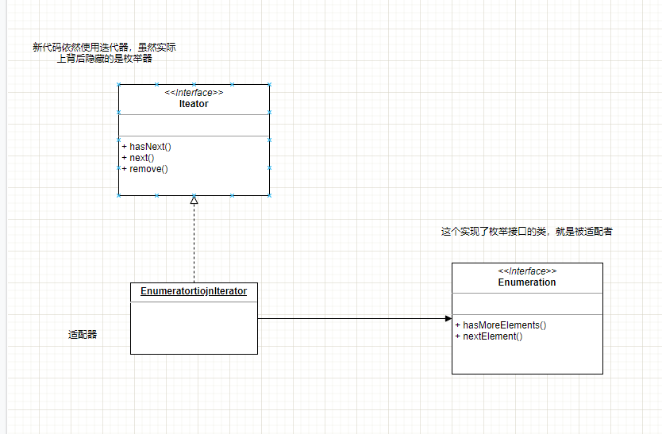

# 1.适配器模式


## 1.真实世界的适配器

如果在欧洲使用美国制造的笔记本电脑插头，那么就不能直接将插头插到插座上，需要一个交流适配器，将一种接口转换成另一种接口。


## 2.面向对象的适配

已有一个软件系统，希望它能和一个新的厂商类库搭配使用。但是换个新厂商所设计出来的接口，不同于旧厂商的接口。如果说不想改变现有的代码，那么就需要将新厂商的接口转接成所期望的接口。

也就是我们说的适配器，这个适配器的工作就如同一个中间人，它将客户所发出的请求转换成厂商类能理解的请求。


## 3.案例一 鸭子的适配


**鸭子接口：**

```java
public interface Duck{
    // 呱呱叫
    public void quack();
    // 飞行
    public void fly();
}
```


**绿头鸭是鸭子的子类：**

```java
public class MallardDuck implements Duck {
    public void quack(){
        System.out.println("Quack");
    }
    
    public void fly(){
        System.out.println("I'm flying");
    }
}
```


**街头顽禽：**

```java
public interface Turkey{
    // 咯咯叫
    public void gobble();
    // 飞行
    public void fly();
}
```

**火鸡的实现：  火鸡属于街头顽禽**

```java
public class WildTurkey implements Turkey{
    
    public void gobble(){
        System.out.println("Gobble goggle");
    }
    
    public void fly(){
        System.out.println("I'm flying a short distance");
    }
}
```


**用火鸡来冒充鸭子，但是因为火鸡的接口不同，所以不能直接拿来用。需要一个适配器**

```java
// 1
public class TurkeyAdapter implements Duck{
    
    Turkey turkey;
    // 2
    public TurkeyAdapter(Turkey turkey){
        this.turkey = turkey;
    }
    // 3
    public void quack(){
        turkey.gobble();
    }
    // 4
    public void fly(){
        for(int i =0 ; i < 5 ; i++){
            turkey.fly();
        }
    }
    
}
```

1. 首先，需要实现选转换成的类型接口，也就是你的客户所期望看到的接口。
2. 接着，需要取得要适配的对象引用，这里我们利用构造器取得这个引用。
3. 现在我们需要实现接口中所有的方法。quack()在类之间的转换很简单，只要调用gobble()就可以了。
4. 固然两个接口都具备了fly()方法，火鸡的飞行距离很短，不像鸭子可以长途飞行。要让鸭子的飞行和火鸡的飞行能够对应，必须连续5次调用火鸡的fly()来完成。


**测试适配方法：**

```java

public class DuckTestDrive {

    public static void main(String[] args) {
        MallardDuck duck = new MallardDuck();

        WildTurkey turkey = new WildTurkey();
        Duck turkeyAdapter = new TurkeyAdapter(turkey);

        duck.quack();
        duck.fly();

        turkeyAdapter.quack();
        turkeyAdapter.fly();
    }
}


```


## 4.适配器定义

适配器模式将一个类的接口，转换成客户期望的另一个接口。适配器让原本接口不兼容的类可以合作无间。





这个适配器模式充满着良好的OO设计原则： 使用对象组合，已修改的接口包装被适配者： 这种做法还有额外的优点，那就是，被适配者的任何子类，都可以搭配着适配器使用。


## 5.适配器案列

**早期的枚举器**

早期的java中，集合collection类型(例如：Vector、Stack、Hashtable)都实现了一个名为elements()的方法。这个方法会返回一个Enumeration。 这个Enumeration接口可以注意走过此集合内的每个元素，而无需知道他们在集合内是如何管理的。

**新的迭代器**

当sun退出更新的集合类时，开始使用了Iterator(迭代器)接口，这个接口和枚举接口很像，都可以让你遍历此集合类型内的每个元素，但不同的是，迭代器还提供了删除元素的能力。

**将枚举适配到迭代器**

这个适配器应该是这样： 需要一个适配器，实现了目标接口，而此目标接口是由被适配者所组合的。hasNext()和next()方法很容易实现，直接把他们从目标对应到被适配者就可以了。但是对于remove()方法，枚举不支持删除，因为枚举是一个只读的接口。适配器无法实现一个有实际功能的remove()方法，最多只能抛出一个运行时异常。幸运地，迭代器接口的设计者事先料到了这样的需要，所以将remove()方法定义成会UnsupportedOperationException。


```java
package java.util;

public interface Enumeration<E> {
    boolean hasMoreElements();

    E nextElement();
}

```


```java
public interface Iterator<E> {

    boolean hasNext();

    E next();

    default void remove() {
        throw new UnsupportedOperationException("remove");
    }


    default void forEachRemaining(Consumer<? super E> action) {
        Objects.requireNonNull(action);
        while (hasNext())
            action.accept(next());
    }
}

```


```java
package org.apache.ibatis.ognl;

import java.util.Enumeration;
import java.util.Iterator;
// 因为要将枚举适配成迭代器 ，适配器要实现迭代器接口
public class EnumerationIterator implements Iterator {
    private Enumeration e;
		
    // 利用组合的方法，将枚举结合进入适配器中，所以用一个实例变量记录枚举
    public EnumerationIterator(Enumeration e) {
        this.e = e;
    }
	// 迭代器的hashNext()方法其实是委托给枚举的hasMoreElements()方法
    public boolean hasNext() {
        return this.e.hasMoreElements();
    }
	// 而迭代器的next()方法其实是委托给枚举的nextElement()方法
    public Object next() {
        return this.e.nextElement();
    }
	// 由于不能支持迭代器的remove()方法，所以必须放弃。做法就是抛出一个异常。
    public void remove() {
        throw new UnsupportedOperationException("remove() not supported by Enumeration");
    }
}

```



